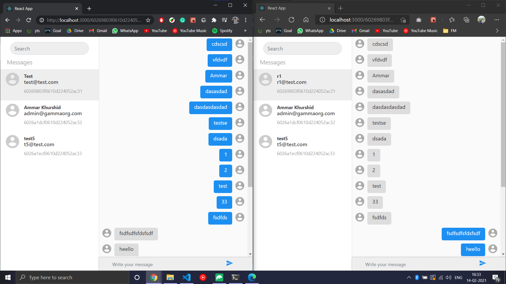

# Chatter
This is a chat application that works on localhost, where a user can sign up/ log in and chat with another user. It uses web sockets to establish and maintain connections between users.  
The [backend](https://github.com/zorgonide/Chatter-backend) was built using Loopback 3.  
The frontend has been built on React, using Redux to manage application state.  

## To run

Clone repository and open terminal in repository folder.  
Run
```
npm install
```
then
```
npm start
```

